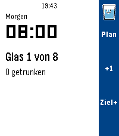
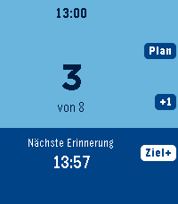
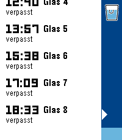
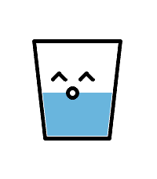
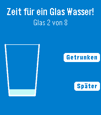

# Drinktervall

Trink-Erinnerung für Pebble (Emery, Flint, Gabbro): acht Gläser Wasser zwischen
8 und 20 Uhr, alle 90 Minuten eine Erinnerung direkt auf der Watch, dazu ein
Pin pro Erinnerung in der Timeline. Farbschema blau/weiss.

## Screenshots

Emery (200 × 228); die Sätze für Flint (schwarz/weiss) und Gabbro (rund)
liegen unter `screenshots/flint` und `screenshots/gabbro`.

| Start | Drei Gläser | Trinkplan | Trinken | Erinnerung |
|---|---|---|---|---|
|  |  |  |  |  |

Erzeugt mit `tools/screenshots.sh <plattform> <projektordner>` (Emulator; Trinken und
Erinnerung stammen aus einem Testbuild mit Zeitlupe und Wakeup nach 60 s).

## Bedienung

**Hauptscreen** - die ganze Fläche ist das Glas: hellblauer Grund, der sich
pro getrunkenem Glas von unten mit Dunkelblau füllt (animiert); darauf
Uhrzeit, Zähler "n von Ziel" und die nächste Erinnerung. Schrift und
Tasten-Hinweise wechseln an der Wasserlinie die Farbe. Einen Zähler nach
unten gibt es bewusst nicht: ein getrunkenes Glas lässt sich nicht
zurücknehmen. Das Tagesziel beginnt bei 8 und lässt sich mit der unteren
Taste für den laufenden Tag erhöhen.

| Taste  | Aktion                          |
|--------|---------------------------------|
| Oben   | Trinkplan des Tages (Liste)     |
| Mitte  | Glas getrunken: ein Vollbild-Fenster zeigt ein Glas mit Gesicht,
|        | das aufploppt, sich leert, ins Zentrum schrumpft und in einem
|        | Strahlenkranz zerplatzt; danach steigen Zähler und Pegel |
| Unten  | Tagesziel um ein Glas erhöhen (nur heute, morgen wieder 8), damit
|        | sich über das Ziel hinaus weiter loggen lässt |

**Erinnerung** - weisser Screen mit dem Glas aus der Trink-Animation (schwarzer
Rahmen, hellblaues Wasser, Lächeln); erscheint zur geplanten Zeit von selbst
(Wakeup), vibriert
dreimal im Abstand von 20 s und bleibt stehen, bis eine Taste gedrückt wird.

| Taste  | Aktion                                  |
|--------|-----------------------------------------|
| Mitte  | Getrunken: Zähler +1                    |
| Unten  | Später: in 10 Minuten nochmals erinnern, die App schliesst sich sofort |
| Zurück | Schliessen ohne zu zählen, das Glas gilt als verpasst; nach einem
|        | Wakeup-Start beendet sich die App, sonst zurück zum Hauptscreen |

Der Zähler wird um Mitternacht automatisch auf 0 gesetzt. Die App-Glance im
Launcher zeigt "n von 8 Gläsern, nächste HH:MM".

## Zeitplan

Grundraster: 08:00, 09:30, 11:00, 12:30, 14:00, 15:30, 17:00, 18:30. Jede
Erinnerung wird um bis zu 10 Minuten vor- oder nachverlegt (`DT_JITTER_MIN`),
deterministisch aus Datum und Slot, so dass Wakeups, Plan-Liste und Glance
dieselben Zeiten zeigen; das Fenster 8 bis 20 Uhr wird nicht verlassen. Alle
Werte stehen in `src/c/config.h` (`DT_START_HOUR`, `DT_END_HOUR`, `DT_GLASSES`,
`DT_JITTER_MIN`, `DT_SNOOZE_MIN`). `DT_GLASSES` darf 8 nicht überschreiten,
weil Pebble pro App höchstens 8 Wakeup-Events erlaubt. Die App plant bei jedem
Start (auch beim Wakeup-Start) alle Wakeups neu, so dass die 8 Slots immer die
nächsten Erinnerungen über die Tagesgrenze hinweg abdecken.

## Timeline

In der Zukunft steht genau ein Pin für die nächste Erinnerung mit den Aktionen
"Getrunken" (öffnet die App und zählt +1) und "App öffnen". In der
Vergangenheit steht für jeden heutigen Slot, der vorbei ist, ein Pin: "Glas n
getrunken" (Häkchen) oder "Glas n verpasst" mit der Aktion "Nachholen", die
das Glas nachträglich zählt. Jeder Slot hat die feste ID
`drinktervall-JJJJMMTT-n`; der Pin der nächsten Erinnerung wird nach dem
Slot zum Getrunken- oder Verpasst-Pin. Die Watch schickt der Telefonseite
(`src/pkjs/index.js`) beim Start, bei jedem Wakeup und nach jeder Änderung
des Zählers den Stand; das JS sendet nur Pins, deren Inhalt sich geändert hat.

Übertragung: Das JS holt per `Pebble.getTimelineToken` einen Token und sendet
die Pins an `https://timeline-api.rebble.io`. Das funktioniert mit der neuen
Pebble-App (Core Devices), sofern sie bei Rebble angemeldet ist. Nur wenn kein
Token zu bekommen ist, wird die lokale Schnittstelle `Pebble.insertTimelinePin`
versucht. Unveränderte Pins werden nach 12 Stunden erneut gesendet. Im Emulator gibt
es keinen Token; die Pins werden dann übersprungen (Log: "timeline: kein Token").

## Farben

`src/c/theme.h`: Hauptscreen LEVEL_LIGHT PictonBlue `#55AAFF` (leer) und
LEVEL_DARK DukeBlue `#0000AA` (Wasser), Schrift OxfordBlue bzw. Weiss.
Listen-Hervorhebung PRIMARY BlueMoon `#0055FF`; Erinnerungs-Screen und
Trink-Animation weiss (FX_BG) mit hellblauem Wasser (FX_WATER PictonBlue). Der Hex-Wert von PRIMARY ist in `src/pkjs/index.js`
(`PIN_COLOR`) von Hand kopiert. Auf Flint (Schwarz/Weiss) ist der Pegel des Hauptscreens schwarz, das Wasser in der Trink-Animation grau gerastert.

## Bauen

Pebble waf verträgt keine Pfade mit Leerzeichen, deshalb wird in WSL unter
`~/drinktervall` gebaut:

```sh
tools/sync_drinktervall.sh <Quellordner>    # Quellen spiegeln + pebble build
pebble install --emulator emery      # oder flint / gabbro
pebble install --phone <IP>          # Developer Connection der Pebble-App
```

Die Skripte liegen unter `tools/` (nach `~` kopieren oder direkt aufrufen):
`sync_drinktervall.sh [<Quellordner>]` spiegelt und baut, `test_screens.sh <plattform>`
macht Screenshots der Screens nach /tmp/drinktervall, `test_wakeup.sh` ist der
Wakeup-Test (Testbuild mit Erinnerung 60 s nach dem Start; setzt
`DT_TEST_WAKEUP` nur in der WSL-Kopie).

Das fertige Paket liegt nach dem Build unter `build/drinktervall.pbw`, eine Kopie
neben dieser README.
