# Drinktervall

Trink-Erinnerung für Pebble (Emery, Flint, Gabbro): Gläser Wasser zwischen 8 und
20 Uhr, eine Erinnerung je Glas direkt auf der Watch, dazu ein Pin pro
Erinnerung in der Timeline. Farbschema blau/weiss.

Voreingestellt sind **acht Gläser**, also alle 90 Minuten eines. Wie viele es
sein sollen, wählt man in den App-Einstellungen der Telefon-App - siehe
Abschnitt [Einstellungen](#einstellungen).

Die Oberfläche folgt der **Sprache der Uhr** (Deutsch und Englisch, Englisch als
Rückfall) - siehe Abschnitt [Sprachen](#sprachen).

## Screenshots

**Emery** (200 × 228, Farbe)

| Start | Drei Gläser | Trinkplan | Trinken | Erinnerung |
|---|---|---|---|---|
|  |  |  |  |  |

**Flint** (144 × 168, schwarz/weiss)

| Start | Drei Gläser | Trinkplan | Trinken | Erinnerung |
|---|---|---|---|---|
| 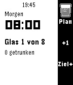 | 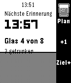 | 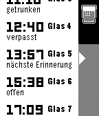 | 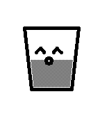 | 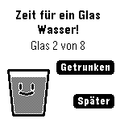 |

**Gabbro** (260 × 260, rund)

| Start | Drei Gläser | Trinkplan | Trinken | Erinnerung |
|---|---|---|---|---|
| 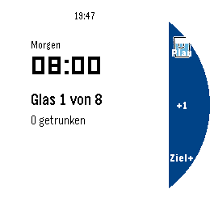 | 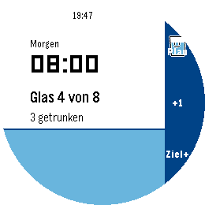 | 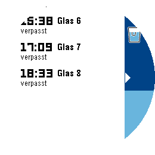 | 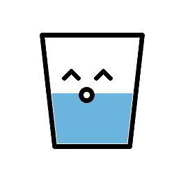 | 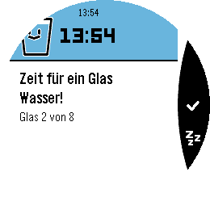 |

**Eigenes Pin-Symbol geht zurzeit nicht.** Die App bringt ihr Glas als
Timeline-Ressource mit (`tools/make_glass_icon.py` zeichnet es leer und voll in
25, 50 und 80 Pixeln, `package.json` veröffentlicht es unter `publishedMedia`
als `GLASS_DRUNK` und `GLASS_FULL`). Die Uhr löst das auch auf, im Emulator
nachgewiesen. Die Telefon-App von Core Devices fängt den Timeline-Aufruf aber
selbst ab und kennt nur Namen aus dem System-Satz; einen unbekannten Namen lässt
sie stillschweigend weg, worauf die Uhr ihr Standardsymbol für `genericPin`
zeichnet, eine Flagge. Nachzulesen in `RemoteTimelineEmulator.kt` und
`TimelineIcon.kt`, offener Fehlerbericht: coredevices/mobileapp Issue 275.
Deshalb stehen in `src/pkjs/index.js` vorerst System-Symbole; die Ressourcen
bleiben liegen, ein Namenswechsel plus erhöhtes `LOOK_VERSION` genügt später.

Erzeugt mit `tools/screenshots.sh <plattform> <projektordner>` (Emulator; Trinken und
Erinnerung stammen aus einem Testbuild mit Zeitlupe und Wakeup nach 60 s).

## Bedienung

**Hauptscreen** - im Stil der Pebble-Timeline: weisser Grund, schwarze Schrift,
rechts die dunkelblaue Seitenleiste mit dem Glas-Symbol oben und den
Tasten-Hinweisen. Aufgebaut wie ein Timeline-Eintrag: kleine Uhrzeit, die
nächste Erinnerung in der LECO-Ziffernschrift, darunter "Glas n von Ziel" und
"n getrunken". Der Pegel (getrunkene Gläser / Tagesziel) steigt als hellblaues
Band mit dunkler Wasserlinie von unten über den Inhalt (animiert). Einen Zähler nach
unten gibt es bewusst nicht: ein getrunkenes Glas lässt sich nicht
zurücknehmen. Das Tagesziel beginnt beim eingestellten Soll und lässt sich mit
der unteren Taste für den laufenden Tag erhöhen.

| Taste  | Aktion                          |
|--------|---------------------------------|
| Oben   | Trinkplan des Tages: Liste wie eine kleine Timeline, Zeit in LECO,
|        | Seitenleiste dunkel für vergangene und hell für kommende Slots,
|        | weisse Pfeilkerbe am gewählten Eintrag |
| Mitte  | Glas getrunken: ein Vollbild-Fenster zeigt ein Glas mit Gesicht,
|        | das aufploppt, sich leert, ins Zentrum schrumpft und in einem
|        | Strahlenkranz zerplatzt; danach steigen Zähler und Pegel. Vom
|        | Hauptscreen aus bleibt die App danach offen |
| Unten  | Tagesziel um ein Glas erhöhen (nur heute, morgen wieder das Soll), damit
|        | sich über das Ziel hinaus weiter loggen lässt |

**Erinnerung** - wie ein Pin-Detail der Timeline, aber ganz in Weiss: oben das
Glas aus der Trink-Animation und die Uhrzeit in LECO, darunter die schwarze
Trennlinie und die Karte mit dem Aufruf, rechts die schwarze Aktionsleiste mit
Häkchen (Getrunken) und Zz (Später). Erscheint zur geplanten Zeit von selbst (Wakeup), vibriert dreimal im Abstand von 20 s und bleibt stehen, bis eine Taste gedrückt wird.

**Die Ruhezeit gilt.** Läuft sie, erscheint die Erinnerung zwar, sie vibriert
aber nicht und macht kein Licht. Das ist von der Uhr übernommen und nicht neu
erfunden: Pebble lässt Mitteilungen während der Ruhezeit ankommen, nur stumm.
Sie ganz zu unterschlagen wäre etwas anderes als still zu sein — ein Glas, von
dem niemand je erfährt, ist kein leiser Hinweis, sondern gar keiner. Auf der
Konfigseite steht dafür **kein** Schalter: die Ruhezeit ist eine Einstellung der
Uhr, und zwei Schalter für dieselbe Sache wären einer zu viel.

| Taste  | Aktion                                  |
|--------|-----------------------------------------|
| Mitte  | Getrunken: Zähler +1, kurze Trink-Animation, dann schliesst sich
|        | die App - die Unterbrechung bleibt so kurz wie möglich. Ohne
|        | Animation bleibt stattdessen kurz der neue Stand stehen |
| Unten  | Später: in 10 Minuten nochmals erinnern, die App schliesst sich sofort |
| Zurück | Schliessen ohne zu zählen, das Glas gilt als verpasst; nach einem
|        | Wakeup-Start beendet sich die App, sonst zurück zum Hauptscreen |

Der Zähler wird um Mitternacht automatisch auf 0 gesetzt. Die App-Glance im
Launcher zeigt "n von m Gläsern, nächste HH:MM".

## Einstellungen

Die App-Einstellungen der Telefon-App (Clay) haben drei Knöpfe:

| Knopf | Was er tut |
|---|---|
| **Gläser pro Tag** | 4 bis 16, voreingestellt 8. Jede Auswahl schreibt den Abstand gleich dazu ("8 Gläser · alle 90 Minuten"), weil die blosse Zahl nichts darüber sagt, wie oft es klopft |
| **Wie viel in dein Glas geht** | nur nötig, um Getrunkenes an eine Gesundheitsakte weiterzureichen; gezählt wird auf der Uhr so oder so in Gläsern |
| **Trink-Animation** | voreingestellt an. Aus heisst: kein formatfüllendes Glas mehr, stattdessen steigt der Pegel auf dem Hauptscreen. Gezählt wird deswegen nichts anders |

Die Seite gibt es auf Deutsch und Englisch; welche gilt, sagt die **Uhr** per
`MESSAGE_KEY_LANG` - das Telefon kann die Uhrsprache nicht von sich aus
erfahren.

Der gewählte Wert geht sofort an die Uhr, wenn die App dort gerade läuft. Meist
läuft sie nicht: die Konfigseite öffnet man aus der Telefon-App heraus, und dann
erreicht die Uhr kein AppMessage. Deshalb liegt das Soll **zusätzlich** im
Speicher des Telefons und fährt beim nächsten Start der App mit der ohnehin
fälligen Anfrage mit. Ohne diesen zweiten Weg verpufft jede Auswahl still.

Ein neues Soll setzt das heutige Tagesziel zurück, fällt dabei aber nie unter
den Zähler: schon getrunkene Gläser gehen nicht verloren.

### Glasgrösse

Dazu steht auf der Seite, **wie viel in ein Glas geht** — 1 dl bis 1 l,
voreingestellt 3 dl. Am Verhalten der Uhr ändert das nichts: gezählt wird
weiter in Gläsern, nicht in Millilitern.

Gebraucht wird die Zahl nur, um getrunkenes Wasser an eine Gesundheitsakte
weiterzureichen. Drinktervall hängt dafür Zeitpunkt und Menge an die
AppMessage, die es nach jedem Glas ohnehin schickt — keine zusätzliche
Übertragung, kein Knopf, kein Bildschirm. Eine Companion-App auf dem Telefon
kann das aufgreifen und in Health Connect eintragen (siehe
[Herzintervall](https://github.com/dysseus-pascal/Herzintervall), Ordner
`companion/`). Wer keine solche App hat, merkt von alldem nichts.

Die beiden Felder stehen **nur** in der Nachricht direkt nach einem Glas, nicht
in den übrigen Standmeldungen. Sonst trüge die Akte bei jedem Aufwachen der Uhr
ein weiteres Glas ein.

Dass das überhaupt geht, obwohl Drinktervall eine pkjs-Telefonseite hat, liegt
an `appMessageToMultipleCompanions` in der Pebble-App: der Schalter steht
standardmässig auf `true`, AppMessages gehen dann an PKJS **und** an eine
klassische Companion-App.

Grenzen und Voreinstellung stehen in `src/c/config.h` (`DT_GLASSES_MIN`,
`DT_GLASSES_MAX`, `DT_GLASSES_DEFAULT`). `tools/pkjs_config_test.js` prüft den
ganzen Weg auf der Telefonseite.

## Zeitplan

Die Gläser verteilen sich gleichmässig über das Fenster 8 bis 20 Uhr. Bei acht
Gläsern ergibt das das Grundraster 08:00, 09:30, 11:00, 12:30, 14:00, 15:30,
17:00, 18:30, bei zwölf ein stündliches. Jede Erinnerung wird um bis zu 10
Minuten vor- oder nachverlegt (`DT_JITTER_MIN`), deterministisch aus Datum und
Slot, so dass Wakeups, Plan-Liste und Glance dieselben Zeiten zeigen; das
Fenster wird nicht verlassen. Alle Werte stehen in `src/c/config.h`
(`DT_START_HOUR`, `DT_END_HOUR`, `DT_JITTER_MIN`, `DT_SNOOZE_MIN`).

Pebble erlaubt pro App höchstens **8 geplante Wakeups**. Das ist trotzdem keine
Obergrenze für die Gläser: die App plant bei jedem Start (auch beim
Wakeup-Start) immer nur die *nächsten* acht Slots und beim übernächsten Start
die darauf folgenden. Bis 1.6.x stand hier, `DT_GLASSES` dürfe 8 nicht
überschreiten - das war zu streng gelesen.

## Timeline

In der Zukunft steht genau ein Pin für die nächste Erinnerung mit den Aktionen
"Getrunken" (öffnet die App und zählt +1) und "App öffnen". In der
Vergangenheit steht für jeden heutigen Slot, der vorbei ist, ein Pin: "Glas n
getrunken" oder "Glas n verpasst" mit der Aktion "Nachholen", die das Glas
nachträglich zählt. Die kommende Erinnerung trägt `NOTIFICATION_REMINDER`, eine
Hand mit Trinkglas, getrunkene Gläser `GENERIC_CONFIRMATION` (einen Stern) und
verpasste `RESULT_DELETED` (einen Totenkopf). Jeder Slot hat die feste ID
`drinktervall-JJJJMMTT-n`; der Pin der nächsten Erinnerung wird nach dem
Slot zum Getrunken- oder Verpasst-Pin. Die Watch schickt der Telefonseite
(`src/pkjs/index.js`) beim Start, bei jedem Wakeup und nach jeder Änderung
des Zählers den Stand; das JS sendet nur Pins, deren Inhalt sich geändert hat.
Die Pin-Texte gibt es auf Englisch und Deutsch; welche gilt, sagt die Watch mit
`MESSAGE_KEY_LANG` (siehe Abschnitt Sprachen).

Übertragung: Das JS holt per `Pebble.getTimelineToken` einen Token und sendet
die Pins an `https://timeline-api.rebble.io`. Das funktioniert mit der neuen
Pebble-App (Core Devices), sofern sie bei Rebble angemeldet ist. Nur wenn kein
Token zu bekommen ist, wird die lokale Schnittstelle `Pebble.insertTimelinePin`
versucht. Unveränderte Pins werden nach 12 Stunden erneut gesendet. Im Emulator gibt
es keinen Token; die Pins werden dann übersprungen (Log: "timeline: kein Token").

## Sprachen

Die App liest beim Start `i18n_get_system_locale()` und folgt damit der
Einstellung der Uhr unter *Settings -> Display -> Language*. Ausgeliefert werden
**Englisch** und **Deutsch**; jede andere Uhrsprache bekommt Englisch. Einen
eigenen Sprachschalter gibt es bewusst nicht.

| Deutsch | Englisch |
|:--:|:--:|
| 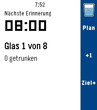 | 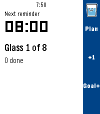 |

Alle Texte der Watch stehen in `src/c/strings_table.h`, eine Zeile je Text:

```
STR(STR_GLASS_N_OF_M, 20, "Glass %d of %d", "Glas %d von %d")
```

Die Datei wird zweimal eingebunden (X-Makro) - einmal für die Aufzählung der
Schlüssel, einmal für die Tabelle. Eine Zeile mit einer Spalte zu wenig ist
deshalb ein **Präprozessorfehler**, kein stiller Rückfall auf die falsche
Sprache. `S(STR_...)` liefert den Text; ein unbekannter Schlüssel oder eine
leere Spalte fällt auf Englisch zurück, statt abzustürzen. Verglichen wird nie
auf `"de_DE"`, sondern auf die ersten zwei Zeichen - ein Sprachpaket darf auch
nur `"de"` liefern.

Die **Texte der Timeline-Pins** stehen nicht dort, sondern in
`src/pkjs/index.js`: sie werden auf dem Telefon gebaut, und das kann die
Uhrsprache nicht von sich aus erfahren. Die Watch schickt sie deshalb als
`MESSAGE_KEY_LANG` mit. Wichtig dabei: die Sprache steht auch in der Signatur,
mit der das JS entdoppelt. Sonst behielte ein Pin, der schon draussen ist, nach
einem Sprachwechsel seinen alten Text - sein Zustand hat sich ja nicht
geändert.

`node tools/strings_check.js` prüft, was der Compiler nicht sieht: leere
englische Spalte, doppelte Schlüssel, Überschreitung eines Zielpuffers in Bytes
(Umlaute zählen doppelt), zwischen den Sprachen abweichende Formatplatzhalter
und Schlüssel, die niemand mehr benutzt. Nicht geprüft werden kann, ob ein
Platzhalter zur C-Aufrufstelle passt - ein Format aus einer Tabelle ist auch
für den Compiler unsichtbar.

**Zum Testen:** Der Emulator meldet `en_US`, ein normaler Lauf zeigt also die
englische Oberfläche. Für die deutsche Seite übersteuert man `strings_refresh()`
vorübergehend in der WSL-Kopie mit `prv_pick_language("de_DE")` und lässt die
Windows-Quelle unangetastet.

Kosten: **+459 Byte** auf flint (9 821 -> 10 280 Byte Abdruck), keine neue
Ressource.

## Farben

`src/c/theme.h`: Hauptscreen LEVEL_LIGHT PictonBlue `#55AAFF` (leer) und
LEVEL_DARK DukeBlue `#0000AA` (Wasser), Schrift OxfordBlue bzw. Weiss.
Listen-Hervorhebung PRIMARY BlueMoon `#0055FF`; Erinnerungs-Screen und
Trink-Animation weiss (FX_BG) mit hellblauem Wasser (FX_WATER PictonBlue). Der Hex-Wert von PRIMARY ist in `src/pkjs/index.js`
(`PIN_COLOR`) von Hand kopiert. Auf Flint (Schwarz/Weiss) ist der Pegel des Hauptscreens schwarz, das Wasser in der Trink-Animation grau gerastert.

## Bauen

Pebble waf verträgt keine Pfade mit Leerzeichen, deshalb wird in WSL unter
`~/drinktervall` gebaut:

```sh
tools/sync_drinktervall.sh <Quellordner>    # Quellen spiegeln + pebble build
pebble install --emulator emery      # oder flint / gabbro
pebble install --phone <IP>          # Developer Connection der Pebble-App
```

Die Konfigseite braucht [Clay](https://github.com/pebble-dev/clay).
`sync_drinktervall.sh` holt es beim ersten Lauf selbst per `npm install`;
`node_modules/` gehört nicht ins Repository.

Die Skripte liegen unter `tools/` (nach `~` kopieren oder direkt aufrufen):
`sync_drinktervall.sh [<Quellordner>]` spiegelt und baut, `test_screens.sh <plattform>`
macht Screenshots der Screens nach /tmp/drinktervall, `test_wakeup.sh` ist der
Wakeup-Test (Testbuild mit Erinnerung 60 s nach dem Start; setzt
`DT_TEST_WAKEUP` nur in der WSL-Kopie).

Ohne Uhr laufen zwei Prüfungen:

```sh
node tools/pkjs_config_test.js            # Konfigseite und Weg des Solls zur Uhr
node tools/strings_check.js src/c/strings_table.h   # Übersetzungen und Pufferlängen
```

Das fertige Paket liegt nach dem Build unter `build/drinktervall.pbw`, eine Kopie
neben dieser README.

## Lizenz

Gemeinfrei, [CC0 1.0](LICENSE). Kopieren, ändern, verkaufen, einbauen — ohne
Bedingung, ohne Namensnennung, ohne Rückfrage.

CC0 statt der Unlicense, weil das Schweizer Urheberrecht einen Verzicht gar
nicht kennt; CC0 trägt für genau diesen Fall eine Ersatzlizenz in sich, die
dasselbe erlaubt.

Alles im Repository ist eigene Arbeit. Das Snooze-Symbol der Aktionsleiste war
es bis 1.6.2 nicht: es stammte aus einer Pebble-App ohne Lizenz. Ersetzt durch
ein eigenes, das `tools/make_snooze_icon.js` erzeugt — damit die Widmung
lückenlos gilt.
