# Drinktervall

Trink-Erinnerung für Pebble (Emery, Flint, Gabbro): Gläser Wasser zwischen 8 und
20 Uhr, eine Erinnerung je Glas direkt auf der Watch, dazu ein Pin pro
Erinnerung in der Timeline. Farbschema blau/weiss.

Voreingestellt sind **acht Gläser**, also alle 90 Minuten eines. Wie viele es
sein sollen, wählt man in den App-Einstellungen der Telefon-App - siehe
Abschnitt [Einstellungen](#einstellungen).

Die Oberfläche folgt der **Sprache der Uhr** (Deutsch, Englisch, Französisch,
Italienisch und Spanisch, Englisch als Rückfall) - siehe Abschnitt [Sprachen](#sprachen).

## Screenshots

**Emery** (200 × 228, Farbe)

| Start | Drei Gläser | Trinkplan | Trinken | Erinnerung |
|---|---|---|---|---|
| 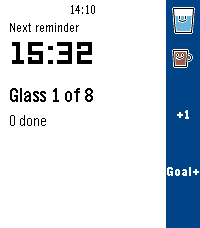 | 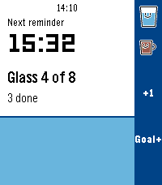 | 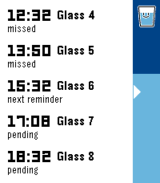 | 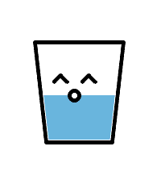 | 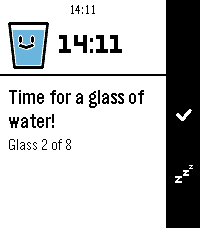 |

| Getränke | Tee, Milch | Tee mit Milch trinken |
|---|---|---|
| 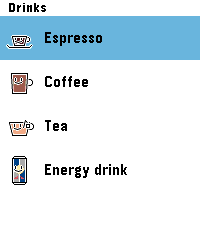 | 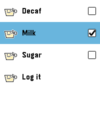 | 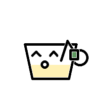 |

**Flint** (144 × 168, schwarz/weiss)

| Start | Drei Gläser | Trinkplan | Trinken | Erinnerung |
|---|---|---|---|---|
| 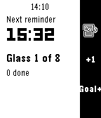 | 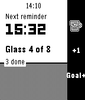 | 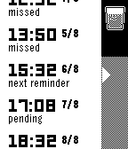 | 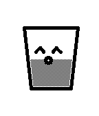 | 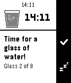 |

| Getränke | Tee, Milch | Tee mit Milch trinken |
|---|---|---|
| 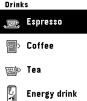 | 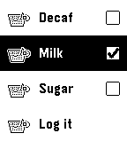 | 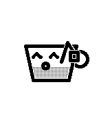 |

**Gabbro** (260 × 260, rund)

| Start | Drei Gläser | Trinkplan | Trinken | Erinnerung |
|---|---|---|---|---|
| 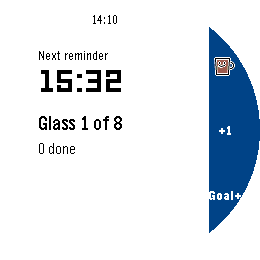 | 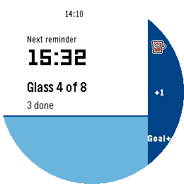 | 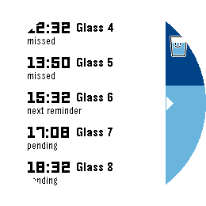 | 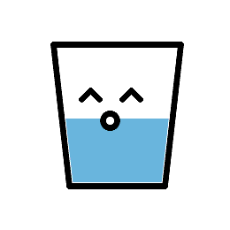 | 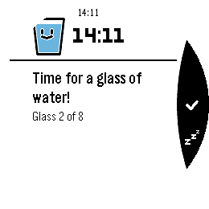 |

| Getränke | Tee, Milch | Tee mit Milch trinken |
|---|---|---|
| 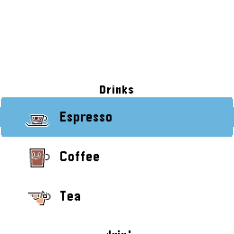 | 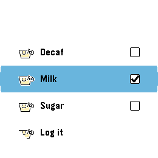 | 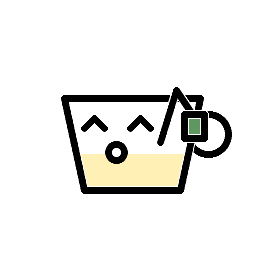 |

**Eigenes Pin-Symbol geht zurzeit nicht.** Die App bringt ihr Glas als
Timeline-Ressource mit (`tools/make_glass_icon.py` zeichnet es leer und voll in
25, 50 und 80 Pixeln, `package.json` veröffentlicht es unter `publishedMedia`
als `GLASS_DRUNK` und `GLASS_FULL`). Die Uhr löst das auch auf, im Emulator
nachgewiesen. Die Telefon-App von Core Devices fängt den Timeline-Aufruf aber
selbst ab und kennt nur Namen aus dem System-Satz; einen unbekannten Namen lässt
sie stillschweigend weg, worauf die Uhr ihr Standardsymbol für `genericPin`
zeichnet, eine Flagge. Nachzulesen in `RemoteTimelineEmulator.kt` und
`TimelineIcon.kt`, offener Fehlerbericht: coredevices/mobileapp Issue 275.
Deshalb stehen in `src/pkjs/index.js` vorerst System-Symbole; die Ressourcen
bleiben liegen, ein Namenswechsel plus erhöhtes `LOOK_VERSION` genügt später.

Erzeugt mit `sh tools/screenshots.sh <plattform>` im Emulator, um 14:10 (die Zeit
setzt `tools/emu_treiber.py`). Die Bilder sind wie bei `pebble screenshot` auf
das Display umgerechnet. Trinken, Erinnerung und Tee mit Milch trinken stammen
aus einem Testbuild mit Zeitlupe und Wakeup nach 60 s. Der Emulator meldet
`en_US`, darum ist die Oberfläche englisch (deutsch siehe [Sprachen](#sprachen)).

## Bedienung

**Tasten auf dem Hauptscreen:** oben die Getränkeauswahl, Mitte kurz ein Glas
Wasser, Mitte lang der Trinkplan, unten das Tagesziel höher. In der
Seitenleiste steht oben ein Becher für die Getränkeauswahl.

**Getränkeauswahl** - für alles ausserhalb des Plans. Oben die eigenen
Getränke (ein Druck trägt ein), dann die vier Sorten. Nach einer Sorte folgen Koffeinfrei, Milch und
Zucker zum Abhaken (Koffeinfrei und Milch nicht beim Energy-Drink); die Auswahl steht schon auf "Eintragen". Danach läuft die
Animation des Gefässes, und der Eintrag geht wie beim Kaffee ans Telefon.

**Hauptscreen** - im Stil der Pebble-Timeline: weisser Grund, schwarze Schrift,
rechts die dunkelblaue Seitenleiste mit dem Glas-Symbol oben und den
Tasten-Hinweisen. Aufgebaut wie ein Timeline-Eintrag: kleine Uhrzeit, die
nächste Erinnerung in der LECO-Ziffernschrift, darunter "Glas n von Ziel" und
"n getrunken". Der Pegel (getrunkene Gläser / Tagesziel) steigt als hellblaues
Band mit dunkler Wasserlinie von unten über den Inhalt (animiert). Einen Zähler nach
unten gibt es bewusst nicht: ein getrunkenes Glas lässt sich nicht
zurücknehmen. Das Tagesziel beginnt beim eingestellten Soll und lässt sich mit
der unteren Taste für den laufenden Tag erhöhen.

| Taste       | Aktion                          |
|-------------|---------------------------------|
| Oben        | Getränkeauswahl (siehe oben) |
| Mitte kurz  | Glas getrunken: ein Vollbild-Fenster zeigt ein Glas mit Gesicht,
|             | das aufploppt, sich leert, ins Zentrum schrumpft und in einem
|             | Strahlenkranz zerplatzt; danach steigen Zähler und Pegel. Vom
|             | Hauptscreen aus bleibt die App danach offen |
| Mitte lang  | Trinkplan des Tages: Liste wie eine kleine Timeline, Zeit in LECO,
|             | Seitenleiste dunkel für vergangene und hell für kommende Slots,
|             | weisse Pfeilkerbe am gewählten Eintrag |
| Unten       | Tagesziel um ein Glas erhöhen (nur heute, morgen wieder das Soll), damit
|             | sich über das Ziel hinaus weiter loggen lässt |

**Erinnerung** - wie ein Pin-Detail der Timeline, aber ganz in Weiss: oben das
Glas aus der Trink-Animation und die Uhrzeit in LECO, darunter die schwarze
Trennlinie und die Karte mit dem Aufruf, rechts die schwarze Aktionsleiste mit
Häkchen (Getrunken) und Zz (Später). Erscheint zur geplanten Zeit von selbst (Wakeup), vibriert dreimal im Abstand von 20 s und bleibt stehen, bis eine Taste gedrückt wird.

**Die Ruhezeit gilt.** Läuft sie, erscheint die Erinnerung zwar, sie vibriert
aber nicht und macht kein Licht. Das ist von der Uhr übernommen und nicht neu
erfunden: Pebble lässt Mitteilungen während der Ruhezeit ankommen, nur stumm.
Sie ganz zu unterschlagen wäre etwas anderes als still zu sein — ein Glas, von
dem niemand je erfährt, ist kein leiser Hinweis, sondern gar keiner. Auf der
Konfigseite steht dafür **kein** Schalter: die Ruhezeit ist eine Einstellung der
Uhr, und zwei Schalter für dieselbe Sache wären einer zu viel.

| Taste  | Aktion                                  |
|--------|-----------------------------------------|
| Mitte  | Getrunken: Zähler +1, kurze Trink-Animation, dann schliesst sich
|        | die App - die Unterbrechung bleibt so kurz wie möglich. Ohne
|        | Animation bleibt stattdessen kurz der neue Stand stehen |
| Unten  | Später: in 10 Minuten nochmals erinnern, die App schliesst sich sofort |
| Zurück | Schliessen ohne zu zählen, das Glas gilt als verpasst; nach einem
|        | Wakeup-Start beendet sich die App, sonst zurück zum Hauptscreen |

Der Zähler wird um Mitternacht automatisch auf 0 gesetzt, auch wenn die App
gerade offen ist (siehe [Der Tag von Zähler und Ziel](#der-tag-von-zähler-und-ziel)).
Die App-Glance im Launcher zeigt "n von m Gläsern, nächste HH:MM" - bis
Mitternacht; danach "0 von m Gläsern" mit dem ersten Glas des neuen Tages.

## Einstellungen

Die App-Einstellungen der Telefon-App (Clay) haben drei Knöpfe, dazu die
[Kaffeezeiten](#kaffeezeiten):

| Knopf | Was er tut |
|---|---|
| **Gläser pro Tag** | 4 bis 16, voreingestellt 8. Jede Auswahl schreibt den Abstand gleich dazu ("8 Gläser · alle 90 Minuten"), weil die blosse Zahl nichts darüber sagt, wie oft es klopft |
| **Wie viel in dein Glas geht** | nur nötig, um Getrunkenes an eine Gesundheitsakte weiterzureichen; gezählt wird auf der Uhr so oder so in Gläsern |
| **Trink-Animation** | voreingestellt an. Aus heisst: kein formatfüllendes Glas mehr, stattdessen steigt der Pegel auf dem Hauptscreen. Gezählt wird deswegen nichts anders |

Die Seite gibt es auf Deutsch und Englisch; welche gilt, sagt die **Uhr** per
`MESSAGE_KEY_LANG` - das Telefon kann die Uhrsprache nicht von sich aus
erfahren.

Der gewählte Wert geht sofort an die Uhr, wenn die App dort gerade läuft. Meist
läuft sie nicht: die Konfigseite öffnet man aus der Telefon-App heraus, und dann
erreicht die Uhr kein AppMessage. Deshalb liegt das Soll **zusätzlich** im
Speicher des Telefons und fährt beim nächsten Start der App mit der ohnehin
fälligen Anfrage mit. Ohne diesen zweiten Weg verpufft jede Auswahl still.

Ein neues Soll setzt das heutige Tagesziel zurück, fällt dabei aber nie unter
den Zähler: schon getrunkene Gläser gehen nicht verloren.

### Glasgrösse

Dazu steht auf der Seite, **wie viel in ein Glas geht** — 1 dl bis 1 l,
voreingestellt 3 dl. Am Verhalten der Uhr ändert das nichts: gezählt wird
weiter in Gläsern, nicht in Millilitern.

Gebraucht wird die Zahl nur, um getrunkenes Wasser an eine Gesundheitsakte
weiterzureichen. Drinktervall hängt dafür Zeitpunkt und Menge an die
AppMessage, die es nach jedem Glas ohnehin schickt — keine zusätzliche
Übertragung, kein Knopf, kein Bildschirm. Eine Companion-App auf dem Telefon
kann das aufgreifen und in Health Connect eintragen (siehe
[Herzintervall](https://github.com/dysseus-pascal/Herzintervall), Ordner
`companion/`). Wer keine solche App hat, merkt von alldem nichts.

Die beiden Felder stehen **nur** in der Nachricht direkt nach einem Glas, nicht
in den übrigen Standmeldungen. Sonst trüge die Akte bei jedem Aufwachen der Uhr
ein weiteres Glas ein.

Dass das überhaupt geht, obwohl Drinktervall eine pkjs-Telefonseite hat, liegt
an `appMessageToMultipleCompanions` in der Pebble-App: der Schalter steht
standardmässig auf `true`, AppMessages gehen dann an PKJS **und** an eine
klassische Companion-App.

Grenzen und Voreinstellung stehen in `src/c/config.h` (`DT_GLASSES_MIN`,
`DT_GLASSES_MAX`, `DT_GLASSES_DEFAULT`). `tools/pkjs_config_test.js` prüft den
ganzen Weg auf der Telefonseite.

### Kaffeezeiten

Ganz unten auf der Seite steht ein Schalter **Kaffee-Erinnerungen**. Erst
eingeschaltet erscheint die Frage, wie viele (1 bis 4), und dann je Kaffee eine
Zeile mit Uhrzeit (Viertelstundenraster 5 bis 23 Uhr), Sorte, Koffeinfrei,
Milch und Zucker - dieselbe Reihenfolge wie die Haken auf der Uhr. Koffeinfrei
und Milch gibt es zu allem ausser dem Energy-Drink.
Koffeinfrei wird eingetragen wie die Sorte, zählt aber kein Koffein.

| Sorte | Nummer |
|---|---|
| Espresso | 0 |
| Kaffee | 1 |
| Tee (bis 1.16 Latte macchiato) | 2 |
| Energy-Drink | 3 |

Jede Sorte hat ihr eigenes Gefäss im Stil des Glases, im Kopf der Erinnerung
und in der Trink-Animation (`glass_fx.c`, `Vessel`): Espressotasse auf
Untertasse, Kaffeebecher, breite Teetasse mit Beutelschnur und Etikett, und
eine Dose in Blau-Silber mit gelber Sonne. In eine Dose sieht man nicht hinein,
sie wird beim Trinken zerdrückt.

**Mit Milch ist das Gefäss heller** — auf der Uhr, nicht nur in der Palette.
Das Farbdisplay ist blass; `pebble screenshot` rechnet die 64 Farben in das um,
was man sieht. Bis 1.19 waren Tee und Tee mit Milch dort gleich, und Tee mit
Milch sah aus wie Kaffee mit Milch. Jetzt:

| Getränk | ohne Milch | mit Milch |
|---|---|---|
| Espresso | `#550000`, auf der Uhr dunkles Rotbraun | `#555500`, milchiges Dunkelbraun |
| Kaffee | `#AA5500`, Braun | `#AAAA55`, Beige |
| Tee | `#FFAA00`, Pfirsich | `#FFFF55`, Creme |

Mit Milch ist jedes um 17 bis 21 L* heller, keine zwei der sechs liegen
näher als ΔE 26, und keine liegt näher als ΔE 31 am Weiss der Tasse, in die
sie fliesst (`sh tools/farben_check.sh` rechnet das aus der Tabelle des
pebble-Werkzeugs nach).

Auf Flint (schwarz/weiss) rundet die Uhr jede Füllfarbe auf vier Graustufen,
und Dunkel- wie Hellgrau werden dasselbe Schachbrett, zur Hälfte schwarz. Milch
trägt dort darum ein eigenes, lichteres Punktraster: ein Viertel schwarz
(`sh tools/glas_host_test.sh` prüft es, `farben_check.sh` die Graustufe ohne
Milch). In der Getränkeauswahl ist das Gefäss nur 22 Pixel breit; beim
Espresso ist die Füllung dort ein gutes Dutzend Pixel gross, das Raster ist zu
sehen, der Unterschied aber klein.

Zur Uhrzeit erscheint eine Erinnerung wie beim Wasser, mit Tasse statt Glas:
Haken = getrunken, Zz = in zehn Minuten nochmals, Zurück = diesmal nicht. Die
festen Zeiten bekommen keinen Versatz; Wasser und Kaffee teilen sich die acht
Wecker der App, es werden immer die nächsten acht Termine gestellt. Ein offenes
"Später" überlebt das Neuplanen durch einen anderen Wecker.

Ein getrunkener Kaffee geht wie ein Glas über eine Warteschlange im Persist ans
Telefon: `COFFEE_AT` (Zeitpunkt) und `COFFEE_KIND` (Sorte in den unteren vier
Bits, Milch `0x10`, Zucker `0x20`, koffeinfrei `0x40`). Eine Companion-App rechnet daraus Koffein
und kcal. Der Plan selbst geht als `COFFEE` hin und her: ein Byte Anzahl, dann
je Kaffee Minute des Tages (2 Byte, little endian), Sorte, Flags (Milch 1,
Zucker 2, koffeinfrei 4). Aus ist ein einzelnes Null-Byte.

### Eigene Getränke

Darunter lassen sich bis zu drei eigene Getränke anlegen: Name (bis 15
Byte: ein Umlaut zählt doppelt, ein Emoji vierfach; gekürzt wird nur an
Zeichengrenzen), kcal, Koffein in mg und auf Wunsch eine Erinnerungszeit. Mit Zeit
erinnert die Uhr täglich wie beim Kaffee ("Time for Proteinshake!"), sonst
steht das Getränk nur in der Getränkeauswahl. Ihre Animation ist das Glas, hellgrün und mit Trinkhalm.

An die Uhr gehen sie als `CUSTOM`, eine Zeile je Getränk: `Name|kcal|mg|Minute`
(Minute des Tages, -1 ohne Erinnerung; ohne viertes Feld keine Erinnerung).
Ein eingetragenes eigenes Getränk reist als `COFFEE_KIND` 4 mit `DRINK_NAME`,
`DRINK_KCAL` und `DRINK_MG` - mit den Werten von dem Moment, in dem es
getrunken wurde.

## Zeitplan

Die Gläser verteilen sich gleichmässig über das Fenster 8 bis 20 Uhr. Bei acht
Gläsern ergibt das das Grundraster 08:00, 09:30, 11:00, 12:30, 14:00, 15:30,
17:00, 18:30, bei zwölf ein stündliches. Jede Erinnerung wird um bis zu 10
Minuten vor- oder nachverlegt (`DT_JITTER_MIN`), deterministisch aus Datum und
Slot, so dass Wakeups, Plan-Liste und Glance dieselben Zeiten zeigen; das
Fenster wird nicht verlassen. Alle Werte stehen in `src/c/config.h`
(`DT_START_HOUR`, `DT_END_HOUR`, `DT_JITTER_MIN`, `DT_SNOOZE_MIN`).

Gerechnet wird in Wanduhrzeit vom Mittag des Tages aus (`schedule_tag`,
`schedule_wandzeit`), nicht als Mitternacht plus Minuten: am Tag der
Sommerzeit-Umstellung hat der Tag 23 oder 25 Stunden, und bis 1.20 kamen die
Wecker dann eine Stunde daneben. Geprüft unter drei Zeitzonen in
`tools/plan_host_test.c`.

Ist das Tagesziel erreicht, kommt für den Rest des Tages keine
Wasser-Erinnerung mehr (auch kein "Später" dazu); Kaffee und eigene Getränke
erinnern weiter. Wird das Ziel mit der Taste unten erhöht, kommen die
Wasser-Erinnerungen zurück.

Pebble erlaubt pro App höchstens **8 geplante Wakeups**. Das ist trotzdem keine
Obergrenze für die Gläser: die App plant bei jedem Start (auch beim
Wakeup-Start) immer nur die *nächsten* acht Slots und beim übernächsten Start
die darauf folgenden. Bis 1.6.x stand hier, `DT_GLASSES` dürfe 8 nicht
überschreiten - das war zu streng gelesen.

## Timeline

In der Zukunft steht genau ein Pin für die nächste Erinnerung mit den Aktionen
"Getrunken" (öffnet die App und zählt +1) und "App öffnen". In der
Vergangenheit steht für jeden heutigen Slot, der vorbei ist, ein Pin: "Glas n
getrunken" oder "Glas n verpasst" mit der Aktion "Nachholen", die das Glas
nachträglich zählt - nur am selben Tag: die Aktion trägt den Tag des Pins im
Launch-Code (`JJJJMMTT1`), und ein Pin von gestern zählt nicht für heute.
Pins von heute, die eine Aktion tragen, aber nicht mehr gelten (Soll gesenkt,
Tagesziel erreicht), werden gelöscht. Die kommende Erinnerung trägt `NOTIFICATION_REMINDER`, eine
Hand mit Trinkglas, getrunkene Gläser `GENERIC_CONFIRMATION` (einen Stern) und
verpasste `RESULT_DELETED` (einen Totenkopf). Jeder Slot hat die feste ID
`drinktervall-JJJJMMTT-n`; der Pin der nächsten Erinnerung wird nach dem
Slot zum Getrunken- oder Verpasst-Pin. Die Watch schickt der Telefonseite
(`src/pkjs/index.js`) beim Start, bei jedem Wakeup und nach jeder Änderung
des Zählers den Stand; das JS sendet nur Pins, deren Inhalt sich geändert hat.
Die Pin-Texte gibt es auf Englisch und Deutsch; welche gilt, sagt die Watch mit
`MESSAGE_KEY_LANG` (siehe Abschnitt Sprachen).

Übertragung: Das JS holt per `Pebble.getTimelineToken` einen Token und sendet
die Pins an `https://timeline-api.rebble.io`. Das funktioniert mit der neuen
Pebble-App (Core Devices), sofern sie bei Rebble angemeldet ist. Ohne Token,
und wenn der REST-Aufruf scheitert (Boulder verweigert einer selbst
installierten App das Netz), geht derselbe Pin über die lokale Schnittstelle
`Pebble.insertTimelinePin` bzw. `Pebble.deleteTimelinePin`. Unveränderte Pins werden nach 12 Stunden erneut gesendet. Im Emulator gibt
es keinen Token; die Pins werden dann übersprungen (Log: "timeline: kein Token").

## Sprachen

Die App liest beim Start `i18n_get_system_locale()` und folgt damit der
Einstellung der Uhr unter *Settings -> Display -> Language*. Ausgeliefert werden
**Englisch**, **Deutsch**, **Französisch**, **Italienisch** und **Spanisch**;
jede andere Uhrsprache bekommt Englisch. Einen eigenen Sprachschalter gibt es
bewusst nicht.

Dieselben fünf Sprachen gelten für die Timeline-Pins und die Konfigseite. Die
Uhr meldet ihre Sprache als Zahl in `MESSAGE_KEY_LANG`: 0 Englisch, 1 Deutsch,
2 Französisch, 3 Italienisch, 4 Spanisch. Die Reihenfolge ist fest - eine
ältere Telefonseite kennt nur 0 und 1 und zeigt bei allem anderen Englisch.
Neue Sprachen kommen nur hinten dazu.

Französisch, Italienisch und Spanisch sind oft länger als Deutsch. Wo ein Text
in einen festen Puffer oder eine schmale Spalte muss, ist die Übersetzung
deshalb knapper als wörtlich (etwa „Bicch. 3“ in der Trinkplan-Liste, „But+“
in der Seitenleiste). Fachbegriffe wie Timeline, Pin und Quiet Time bleiben
unübersetzt.

| Deutsch | Englisch |
|:--:|:--:|
| 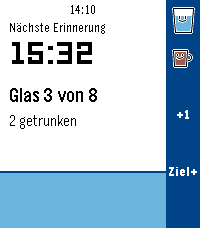 | 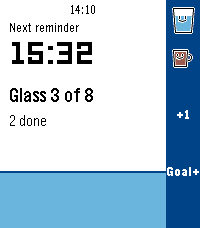 |

Alle Texte der Watch stehen in `src/c/strings_table.h`, eine Zeile je Text:

```
STR(STR_GLASS_N_OF_M, 20, "Glass %d of %d", "Glas %d von %d", "Verre %d sur %d", "Bicchiere %d/%d", "Vaso %d de %d")
```

Die Datei wird zweimal eingebunden (X-Makro) - einmal für die Aufzählung der
Schlüssel, einmal für die Tabelle. Eine Zeile mit einer Spalte zu wenig ist
deshalb ein **Präprozessorfehler**, kein stiller Rückfall auf die falsche
Sprache. `S(STR_...)` liefert den Text; ein unbekannter Schlüssel oder eine
leere Spalte fällt auf Englisch zurück, statt abzustürzen. Verglichen wird nie
auf `"de_DE"`, sondern auf die ersten zwei Zeichen - ein Sprachpaket darf auch
nur `"de"` liefern.

Die **Texte der Timeline-Pins** stehen nicht dort, sondern in
`src/pkjs/index.js`: sie werden auf dem Telefon gebaut, und das kann die
Uhrsprache nicht von sich aus erfahren. Die Watch schickt sie deshalb als
`MESSAGE_KEY_LANG` mit. Wichtig dabei: die Sprache steht auch in der Signatur,
mit der das JS entdoppelt. Sonst behielte ein Pin, der schon draussen ist, nach
einem Sprachwechsel seinen alten Text - sein Zustand hat sich ja nicht
geändert.

`node tools/strings_check.js` prüft, was der Compiler nicht sieht: leere
englische Spalte, doppelte Schlüssel, Überschreitung eines Zielpuffers in Bytes
(Umlaute zählen doppelt), zwischen den Sprachen abweichende Formatplatzhalter
und Schlüssel, die niemand mehr benutzt. Nicht geprüft werden kann, ob ein
Platzhalter zur C-Aufrufstelle passt - ein Format aus einer Tabelle ist auch
für den Compiler unsichtbar.

**Zum Testen:** Der Emulator meldet `en_US`, ein normaler Lauf zeigt also die
englische Oberfläche. Für die deutsche Seite übersteuert `tools/screenshots.sh`
`strings_refresh()` in einer Kopie mit `prv_pick_language("de_DE")`; die
Quelle bleibt unangetastet.

Kosten: **+459 Byte** auf flint (9 821 -> 10 280 Byte Abdruck), keine neue
Ressource.

## Farben

`src/c/theme.h`: Hauptscreen LEVEL_LIGHT PictonBlue `#55AAFF` (leer) und
LEVEL_DARK DukeBlue `#0000AA` (Wasser), Schrift OxfordBlue bzw. Weiss.
Listen-Hervorhebung PRIMARY BlueMoon `#0055FF`; Erinnerungs-Screen und
Trink-Animation weiss (FX_BG) mit hellblauem Wasser (FX_WATER PictonBlue). Der Hex-Wert von PRIMARY ist in `src/pkjs/index.js`
(`PIN_COLOR`) von Hand kopiert. Auf Flint (Schwarz/Weiss) ist der Pegel des
Hauptscreens zur Hälfte schwarz gerastert, mit schwarzer Wasserlinie; die
Schrift darüber steht auf Weiss, sonst ginge sie im Raster unter. Das Wasser
in der Trink-Animation ist ebenso gerastert.

## Bauen

Im Repository, mit Clay für die Konfigseite
([Clay](https://github.com/pebble-dev/clay), kommt per `npm install`;
`node_modules/` gehört nicht ins Repository):

```sh
npm install --no-audit --no-fund     # einmal
pebble build                         # Paket: build/<Ordnername>.pbw
pebble install --emulator emery      # oder flint / gabbro
pebble install --phone <IP>          # Developer Connection der Pebble-App
```

Pebble waf verträgt keine Pfade mit Leerzeichen. Liegt die Quelle unter einem
solchen Pfad, spiegelt `tools/sync_drinktervall.sh <Quellordner>` sie nach
`~/drinktervall` und baut dort.

Im Emulator, ohne die Quelle zu ändern (beide bauen ihre Prüfbauten in einer
Kopie unter `$TMPDIR`; `pebble wipe` darin löscht die Daten aller Emulatoren
dieser SDK):

```sh
sh tools/screenshots.sh <plattform>   # die Bilder oben, um 14:10
sh tools/test_wakeup.sh               # Erinnerung 60 s nach dem Start: Getrunken, dann Später
```

Ohne Uhr laufen diese Prüfungen:

```sh
node tools/pkjs_config_test.js            # Konfigseite und Weg des Solls zur Uhr
node tools/strings_check.js src/c/strings_table.h   # Übersetzungen und Pufferlängen
sh tools/schedule_host_test.sh            # Tag von Zähler und Ziel (Rechner-C, pebble.h als Attrappe)
sh tools/phone_host_test.sh               # Nachricht ans Telefon: grösster Fall, Schlange, Log, Namen, Frage nach der Zeit
sh tools/farben_check.sh                  # Getränkefarben, wie Farb- und Schwarz-Weiss-Display sie zeigen
sh tools/glas_host_test.sh                # Milch auf Schwarz-Weiss: lichteres Raster statt Grau (Grafik als Attrappe)
sh tools/plan_host_test.sh                # Wecker, Plan-Liste, Pins an Umstellungstagen; Tagesziel erreicht (drei Zeitzonen)
sh tools/app_host_test.sh                 # die App als Ganzes: Glance, Pin von gestern, neue Erinnerung nach dem Haken
node tools/pkjs_pins_test.js              # Timeline-Pins: veraltete löschen, REST mit Rückfall, Tag im Launch-Code
node tools/pkjs_clay_test.js              # Konfigseite mit dem echten Clay (nach npm install und pebble build)
node tools/catch_check.js                 # kein catch ohne Log in der Telefonseite
```

Den Clay-Test erst nach `pebble build`: `npm install` legt Clay nur als
`dist.zip` ab, entpackt wird es beim Bau. Ohne Bau geht es so:
`python3 -m zipfile -e node_modules/@rebble/clay/dist.zip node_modules/@rebble/clay/dist`.

Die CI (`.github/workflows/bauen.yml`) entpackt Clay so und führt dann alle
`tools/*host_test.sh` und `tools/*test*.js` sowie `catch_check.js` und
`strings_check.js` aus; ein roter Test hält den Lauf vor dem Einchecken und vor
dem Release an.

Eine Kopie des fertigen Pakets liegt als `drinktervall.pbw` neben dieser README.

## Store-Symbole

Der Appstore nimmt **nichts aus der `.pbw`**. Das `menuIcon` darin ist das
Symbol im Starter der Uhr; für die Store-Liste liegen im Entwicklerportal zwei
eigene Bilder, `icon_large` und `icon_small`. Ein Watchface braucht sie nicht,
eine Watchapp schon.

Angefordert werden sie in festen Massen — gross **80×80** und **144×144**,
klein **28×28** und **48×48** —, jeweils mit `exact` in der Adresse: die Masse
werden **erzwungen, nicht eingepasst**. Etwas Nicht-Quadratisches kommt verzogen
zurück. Das grosse Symbol legt der Store ausserdem für sein Teilen-Bild durch
eine abgerundete Maske — darum eine gefüllte Kachel und keine freistehende
Linie.

In [store/](store/) liegen `icon-144.png` und `icon-48.png`:

```bash
python3 tools/make_app_icon.py --store store
```

Sie entstehen aus **derselben Formbeschreibung** wie das 25×25 der Uhr — alle
Masse gelten auf einem Raster von 25 Punkten und werden hochgerechnet. Ohne
`--store` erzeugt dasselbe Werkzeug weiterhin Punkt für Punkt das alte
`system_icon.png`; dass es das wirklich tut, ist byteweise nachgeprüft.

## Lizenz

Gemeinfrei, [CC0 1.0](LICENSE). Kopieren, ändern, verkaufen, einbauen — ohne
Bedingung, ohne Namensnennung, ohne Rückfrage.

CC0 statt der Unlicense, weil das Schweizer Urheberrecht einen Verzicht gar
nicht kennt; CC0 trägt für genau diesen Fall eine Ersatzlizenz in sich, die
dasselbe erlaubt.

Alles im Repository ist eigene Arbeit. Das Snooze-Symbol der Aktionsleiste war
es bis 1.6.2 nicht: es stammte aus einer Pebble-App ohne Lizenz. Ersetzt durch
ein eigenes, das `tools/make_snooze_icon.js` erzeugt — damit die Widmung
lückenlos gilt.

## Einstellen auf der Konfigseite

Soll, Glasgrösse und Animation stellt man auf der Konfigseite in der
Pebble-App ein. **Die Uhr ist die eine Stelle, an der sie gelten.** Die
Konfigseite schickt ihre Änderung an die Uhr, und die Uhr meldet mit jeder
Standmeldung, was gilt (`TARGET`, `GLASS_ML`, `ANIMATION`). Die Telefonseite
übernimmt das in die Konfigseite. Boulder liest dieselbe Meldung mit und
ändert an den Einstellungen nichts.

Von 1.12.0 an liessen sie sich auch in
[Kiesel-Helper](https://github.com/dysseus-pascal/Kiesel-Helper) ändern.
Kiesel-Helper ist seit dem 29.09.2026 archiviert, seine Aufgaben hat Boulder
übernommen. Bis 1.11 schickte die Telefonseite bei jedem Start ihren
gespeicherten Stand an die Uhr; eine Änderung aus Kiesel-Helper wäre damit
beim nächsten Öffnen wieder überschrieben worden. Seither geht beim Start nur
noch, was auf der Konfigseite gespeichert wurde, aber nie ankam — dafür steht
ein Vermerk, bis die Uhr bestätigt.

## Kein Glas geht verloren

Seit 1.11.0 steht jedes Glas in einer **Warteschlange im Persist**, bis das
Telefon die Nachricht bestätigt hat, die es trug. Bis dahin gab es nur einen
Vermerk im Speicher, der beim Schreiben der Nachricht verbraucht war — ob sie
ankam oder nicht. War der Postausgang besetzt, antwortete das Telefon nicht
rechtzeitig, oder ging die App nach der Animation zu, bevor die Nachricht
draussen war, war das Glas auf der Uhr gezählt und für Kiesel-Helper (heute
Boulder) verloren.
Zwei Gläser vor einer erfolgreichen Nachricht wurden zu einem.

Jetzt trägt jede Nachricht das älteste unbestätigte Glas; nach der Bestätigung
geht das nächste. Scheitert eine, fasst die Uhr bis zu fünfmal nach. Nach dem
Trinken hält das Trink-Fenster die App bis zu fünf Sekunden offen, bis das
Telefon das Glas hat. Was dann noch in der Schlange steht, geht beim nächsten
Start. Boulder (früher Kiesel-Helper) trägt ein Glas je Zeitpunkt nur einmal
ein — doppelt geschickt ist harmlos.

**Mitgeschickt ist ein Glas nur, wenn es in der Nachricht steht.** Bis 1.19
prüfte die Uhr nicht, ob ein Feld in den Postausgang passte: ein Glas, das
nicht mehr hineinging, galt trotzdem als mitgeschickt und fiel mit der
Bestätigung aus der Schlange. Jetzt bleibt es stehen, die Uhr fasst in
gezählten Anläufen nach, und was nicht passt oder gar nicht hinausgeht, steht
im Log. Geprüft in `tools/phone_host_test.c`.

## Der Tag von Zähler und Ziel

Jede Standmeldung trägt neben dem Tagesziel (`GLASSES`) seinen Tag
(`GOAL_DAY`, JJJJMMTT). Das per Taste erhöhte Ziel gilt nur für diesen Tag;
ohne ihn musste das Telefon den Tag der Ankunft nehmen, und eine Meldung von
23:59, die erst nach Mitternacht ankam, hob das Ziel des neuen Tages an. Es
ist der Tag, zu dem Zähler und Ziel im Persist gehören — steht die Uhr nach
einem Neustart kurz zu früh, bleibt es der gemerkte.

Der Schlüssel steht am **Ende** der `messageKeys` (10056); eine ältere
Telefonseite überliest ihn.

**Ein neuer Tag beginnt nur vorwärts**, und zwar auch, während die App offen
ist (bis 1.19 nur beim Start: das erste Glas nach Mitternacht zählte zum
alten Tag). Springt die Uhr zurück — nach einem Neustart steht sie kurz auf
einer alten Zeit —, bleiben Gläser und Ziel stehen (seit 1.16.2), auch ein
Glas, das man trinkt, während sie noch auf gestern steht. Liegt der gemerkte
Tag mehr als zwei Tage voraus und geht die Uhr plausibel (ab 2025), war er
falsch: dann gilt heute, die Werte bleiben. „Zwei Tage“ wird genau gezählt —
bis 1.19 schätzte die Uhr jeden Monat zu 31 Tagen, und ein Rücksprung vom
1. März auf den 28. Februar galt als vier Tage.

**Stand die Uhr vor** und wurde zurückgestellt, sieht das für die Uhr genauso
aus wie ein Neustart: Auch dann liegt sie hinter dem gemerkten Tag. Bis 1.19
zählten die Gläser des echten Tages dann zum vorausgeeilten Tag und standen am
echten Folgetag noch da. Welche Zeit falsch war, weiss nur das Telefon. In
diesem Zustand trägt darum jede Standmeldung die Uhrzeit der Uhr (`UHRZEIT`,
Schlüssel 10057), und die Telefonseite antwortet mit ihrer. Weichen beide
höchstens 300 s ab und stehen auf demselben Tag, geht die Uhr richtig: Heute
gilt, Gläser und Ziel bleiben, und am echten Folgetag beginnt ein neuer Tag.
Sonst bleibt der gemerkte Tag. Was bleibt:

- Antwortet das Telefon nicht (keine Verbindung, pkjs läuft nicht), bleibt es
  beim Verhalten bis 1.19: Die Gläser stehen am echten Folgetag noch da.
- Gefragt wird nur, während die App läuft und eine Standmeldung schickt: beim
  Start, bei jeder Erinnerung, nach einem Glas oder einer Einstellung. Läuft
  sie am berichtigten Tag nicht mehr — etwa weil die Uhr nach der letzten
  Erinnerung gestellt wird und man die App an diesem Tag nicht mehr öffnet —,
  fragt sie nie. Am echten Folgetag steht die Uhr dann wieder auf dem
  gemerkten Tag, und die Gläser stehen noch da wie bis 1.19.
- Springt die Uhr plausibel mehr als zwei Tage zurück, gilt der gemerkte Tag
  ohne Rückfrage als falsch (seit 1.16.2). War es doch die Uhr, die so weit
  zurückstand, ist das Stellen danach für sie ein neuer Tag.
- Springt die Uhr vor, ist das für sie ein neuer Tag (wie bisher).

Geprüft in `tools/schedule_host_test.c` (vorwärts, rückwärts, getrunken auf gestern,
Monats- und Jahresenden, Vorlauf mit und ohne Telefon, 300/301 s,
Mitternacht, Glas und Taste unten gleich nach Mitternacht),
`tools/phone_host_test.c` (Frage, Antwort, berichtigter Tag in der
Standmeldung) und `tools/pkjs_config_test.js` (Antwort der Telefonseite in
Sekunden).

**Der Postausgang** hat 448 Byte. Der grösste Fall — 16 Gläser, vier
Kaffees im Plan, drei eigene Getränke mit 15-Byte-Namen, Höchstwerten und
Erinnerung, dazu ein Glas und ein eigenes Getränk unterwegs — braucht 395
Byte, mit der Frage nach der Zeit 406; `tools/phone_host_test.c` baut beides
nach und zählt nach. Bis 1.19 hatte die Uhr für die eigenen Getränke aber nur
84 Byte Text: drei lange Namen mit vierstelligen Werten und Erinnerung
brauchen 92 Zeichen und die Null, und alles nach Zeichen 83 fiel still weg.
Im Emulator nachgestellt (drei Getränke mit 15-Byte-Namen, 2000 kcal, 1000 mg,
Erinnerung 22:00): vom dritten kam nur `Matcha Latte 15|2000|` an, die
Konfigseite zeigte danach Koffein 0 und keine Erinnerung und hätte das beim
nächsten Speichern zurückgeschickt. Jetzt hat der Text 99 Byte, und ein Text,
der doch nicht ganz passt, geht gar nicht hinaus.
